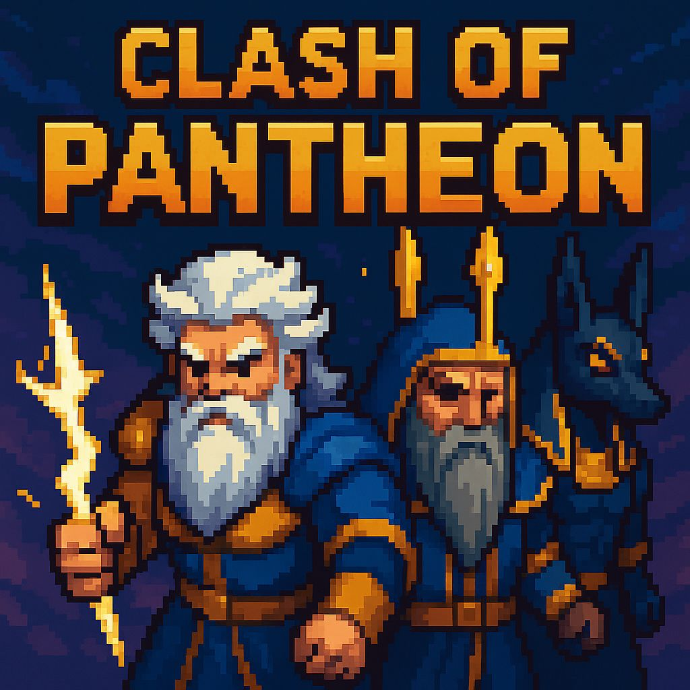

# 🏛️ Clash of Pantheons: The Gate Guardians

> **O equilíbrio entre os mundos foi rompido.** > Fantasmas, demônios e entidades esquecidas emergem para consumir a existência. Em um pacto inédito, os grandes deuses se uniram para guardar a passagem.

## 📖 Sobre o Jogo
**Clash of Pantheons** é um jogo de estratégia no estilo **Tower Defense** (inspirado em *Bloons TD*). O jogador atua como um arquiteto divino, posicionando divindades ao longo de um caminho para impedir que hordas de inimigos atravessem o Portal Ancestral.

O foco do jogo é o gerenciamento de recursos (**Ouro Divino**) e a sinergia entre diferentes mitologias.

## ⚡ Os Guardiões (Torres)

| Divindade | Mitologia | Tipo de Dano | Habilidade Especial |
| :--- | :---: | :--- | :--- |
| **Zeus** | Grega | ⚡ Rápido / Único | **Raios Fulminantes:** Ataques rápidos de alto dano, ideais para eliminar alvos ágeis. |
| **Anubis** | Egípcia | ☠️ Debuff / DoT | **Maldição:** Reduz a velocidade dos inimigos e drena vida com veneno místico. |
| **Odin** | Nórdica | 🦅 Longo Alcance | **Huginn & Muninn:** Comanda corvos que cruzam o mapa e retornam, causando dano contínuo. |

## 🎮 Mecânicas Principais
* **Defesa de Caminho:** Posicionamento estratégico em grid/caminho livre.
* **Economia:** Ganhe Ouro Divino ao banir inimigos para o submundo.
* **Sistema de Upgrades:** Utilize o ouro para desbloquear novas fases de poder dos deuses já invocados.
* **Ondas (Waves):** Inimigos progressivamente mais fortes e em maior número.

## 🛠️ Instalação e Execução

Para rodar o projeto localmente, siga os passos abaixo:

### Pré-requisitos
* Python 3.10 ou superior
* Git

### Rodando
* Intale os requisitos usando o pip
* Abra a pasta principal
* E rode "python3 main.py"
